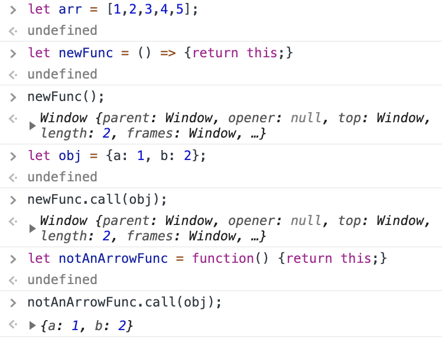

# functions
#use/javascript

[[Study Web Development - Fullstack]]

#use/javascript
* Syntax (Updated: [[20200825]])
	* [Arrow function expression syntax](https://developer.mozilla.org/en-US/docs/Web/JavaScript/Reference/Functions/Arrow_functions)
	* [Arrow notation - FCC](https://www.freecodecamp.org/learn/javascript-algorithms-and-data-structures/es6/use-arrow-functions-to-write-concise-anonymous-functions)

**ES6 or ECMAScript 2015**

In JavaScript, we often don’t need to name our functions, especially when passing a function as an argument to another function. Instead, we create inline functions. We don’t need to name these functions because we do not reuse them anywhere else.

When there is no function body, and only a return value, arrow function syntax allows you to omit the keyword return as well as the brackets surrounding the code. This helps simplify smaller functions into one-line statements:

`const myFunc = () => “value”;`

This code will still return value by default.

`const magic = () => new Date();`

returns a date object

In order to help us create more flexible functions, ES6 introduces _default parameters_ for functions.

* Accessing arguments
	* [[arguments]] object
* Returning values
	* [codeburst - ES5 or ECMA-262 5.1 from 2011](https://codeburst.io/javascript-what-is-the-return-statement-97d8b11a1a0c) 

### Illustration of difference between arrow and traditional function notation

