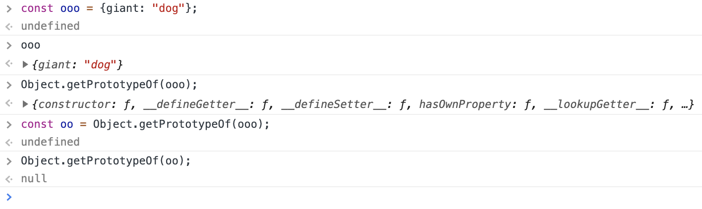
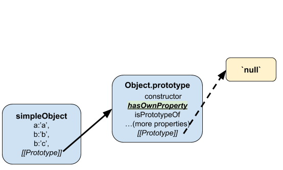

# objects
#use/javascript

```javascript
/**
/* Introspection
 */
Object.getPrototypeOf(someObject); // discover someObject's internal prototype
someObject instanceof Array; // test to see if Array constructor shows up
someObject.constructor.name;
// anywhere in the prototype chain of someObject

```
**Source** [Object - JavaScript | MDN](https://developer.mozilla.org/en-US/docs/Web/JavaScript/Reference/Global_Objects/Object)
- - - -
-> [[Study Web Development - Fullstack]]
## comparing objects
- [ ] deep equality?
## Prototypes?
- [ ] what is the difference between internal prototype and `.prototype` property on a function?
- [ ] what is `Object.create` and how can it be used?
- [ ] explain the prototype chain.
- [ ] how can you place properties and methods on the `.prototype` object for classes and constructor functions?
- [ ] [The Secret Life of Objects :: Eloquent JavaScript](https://eloquentjavascript.net/06_object.html)

Objects may be instantiated and created for us either using literal notation, using the new keyword, or by using the Object.create function. We’ll discuss these in order here.

Before we can describe what happens when we use the `new` keyword and the `Object.create` function, we’ll need to explain first something called the prototype chain, and the notions of factory functions and constructor functions.

## object literals
objects are key-value stores, and one can instantiate an object in memory using literal notation that looks like:

```javascript
let o = {}
let o = {a: 'foo', b: 42, c: {}}

let a = 'foo', b = 42, c = {}
let o = {a: a, b: b, c: c}

let o = {
  property: function (parameters) {},
  get property() {},
  set property(value) {}
};

// ES2015 brings us
// Shorthand property names (ES2015)
let a = 'foo', b = 42, c = {};
let o = {a, b, c}

// Shorthand method names (ES2015)
let o = {
  property(parameters) {}
}

// Computed property names (ES2015)
let prop = 'foo'
let o = {
  [prop]: 'hey',
  ['b' + 'ar']: 'there'
}
```

Note the ::keys::, the `:`, and the ::values:: all comma-separated.

## defining properties on an object
**source** Freecodecamp.org

* dot notation - limited to objects with keys without spaces… seems kinda lame
* bracket notation - use strings dude, always use strings; The second way to access the properties of an object is bracket notation (`[]`). If the property of the object you are trying to access has a space in its name, you will need to use bracket notation.

However, if your object has any non-string properties, JavaScript will automatically typecast them as strings.

After you’ve created a JavaScript object, you can update its properties at any time just like you would update any other variable. You can use either dot or bracket notation to update.

object properties can be modified, added in intuitive ways.

## remove properties from objects
Less intuitive is the keyword `delete` for removing properties.

```javascript
// Setup
var myDog = {
  "name": "Happy Coder",
  "legs": 4,
  "tails": 1,
  "friends": ["freeCodeCamp Campers"],
  "bark": "woof"
};

// Only change code below this line
delete myDog["tails"];
```

## look up values from objects
Use objects as dictionaries to look things up
```javascript
// Setup
function phoneticLookup(val) {
  var result = "";

  // Only change code below this line
  var lookup = {
    "alpha": "Adams",
    "bravo": "Boston",
    "charlie": "Chicago",
    "delta": "Denver",
    "echo": "Easy",
    "foxtrot": "Frank"
  }
  result = lookup[val];
  // Only change code above this line
  return result;
}

phoneticLookup("charlie");
```

Sometimes it is useful to check if the property of a given object exists or not. We can use the `.hasOwnProperty(propname)` method of objects to determine if that object has the given property name. `.hasOwnProperty()` returns `true` or `false` if the property is found or not.

```javascript
function checkObj(obj, checkProp) {
  // Only change code below this line
  if (obj.hasOwnProperty(checkProp) === true) {
    return obj[checkProp];
  } else {
    return "Not Found";
  }
  // Only change code above this line
}
```

Updating a complex object with incomplete data

```javascript
// Setup
var collection = {
  2548: {
    album: "Slippery When Wet",
    artist: "Bon Jovi",
    tracks: [
      "Let It Rock",
      "You Give Love a Bad Name"
    ]
  },
  2468: {
    album: "1999",
    artist: "Prince",
    tracks: [
      "1999",
      "Little Red Corvette"
    ]
  },
  1245: {
    artist: "Robert Palmer",
    tracks: [ ]
  },
  5439: {
    album: "ABBA Gold"
  }
};

// Only change code below this line
function updateRecords(id, prop, value) {
  if (value === "") {
    delete collection[id][prop];
    return collection;
  } else if (prop === "tracks" && collection[id].hasOwnProperty(prop)) {
    collection[id][prop].push(value);
  } else if (prop === "tracks") {
    collection[id]["tracks"] = [];
    collection[id][prop].push(value);
  } else {
    collection[id][prop] = value;
  }
  return collection;
}

updateRecords(5439, "artist", "ABBA");
```

## concatenating objects
[Object.assign() - JavaScript | MDN](https://developer.mozilla.org/en-US/docs/Web/JavaScript/Reference/Global_Objects/Object/assign)

## objects and their place in the prototype chain
[[constructors]]
If we dig a little deeper into the structure of objects, we notice that not only do they possess the properties explicitly assigned to them, but they also possess a few very special properties:

* Internal prototype (commonly referred to as `[[Prototype]]` in the literature or `__proto__`  in some browser consoles)
	* We can access an object’s internal prototype by using the built-in method `Object.getPrototypeOf`
	* Any object can check whether it is the internal prototype for another object, i.e. it is in that object’s prototype chain using `Object.prototype.isPrototypeOf`
	* Interestingly, one can change the internal prototype of an object using `Object.setPrototypeOf`

When discussing internal prototypes, we often speak of a ::prototype chain:: because the internal prototype of an object is a reference or link to another object with its own internal prototype in turn.

One might wonder if the chain ever ends. Indeed it does. See the example below:



In the Chrome Dev Tools console we instantiate a object `ooo` with the obvious property keyed _giant_ and valued _“dog”_. We get its `[[Prototype]]`, which turns out to be an object called `Object.prototype`. We get its `[[Prototype]]`, which turns out to be `null` and the chain ends there.



::Internal prototypes are important because:: they usually contain methods that can be used by an instance of an object and are shared between objects that have the same internal prototype.

So this brings us to the use of `Object.create(<an object that will serve as a prototype>)`, which takes as its argument an object that we want to serve as the internal prototype of the new object returned by `Object.create`.

### Functions and their prototype property
* `Function.prototype`

This property `prototype` is distinct from the “internal prototype” as discussed above. This is a property that is on the instance of a function, and by default JavaScript assigns to this property an object that has two very specific properties of its own:
	* constructor
	* internal prototype or `__proto__` or `[[Prototype]]`

The ::constructor property:: here is assigned the very same function object to which `.prototype` belongs.

It is this very interesting property `prototype` that imbues within each function the potential to be used as a “constructor.”  To “use as a constructor,” one simply creates a new object instance by way of an expression with the `new` keyword, e.g. `let dogs = new Array();`.

Furthermore, upon inspecting `dogs`, we see how the `Function.prototype` is used as the object of reference for the _internal prototype_ of our little object `dogs`. Indeed `Object.getPrototypeOf(dogs) === Array.prototype` should evaluate to `true`.

Since instances of objects created with the `new` keyword have internal prototypes that are the same objects referenced by the `.prototype` property, we can define stuff we want all instances to access by assigning values (anything: e.g. objects, primitives, function definitions) them to the `Function.prototype` object.

Finally, factory functions are any other non-constructor and non-class function that returns an object literal. Learn more about how to use the Factory function pattern below.

## Factory functions
Super easy to create new objects because they are just functions that return objects.

So `let dogs = Array();`

The instance properties are obviously defined on the object that a factory function returns.

If you create that object using `Object.create` that is where you can customize what ends up being the internal prototype of your factory-made object.

To specify some object as the internal prototype of your factory-made object…