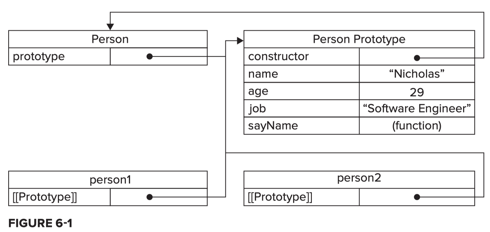
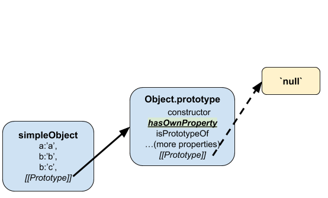
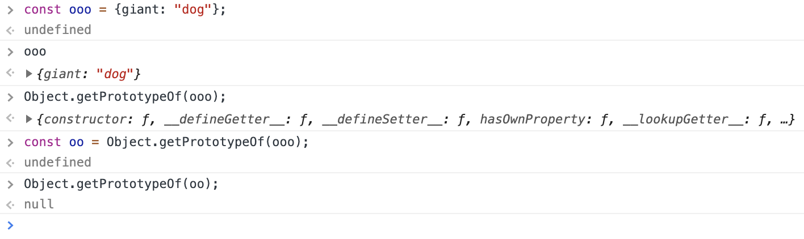

# prototypes
#use/javascript

[[Study Web Development - Fullstack]]

[[constructors]]


**Source** Nicholas Zakas, Professional JavaScript for Web Developers 3rd Edition
_Person is an example of a constructor function_
_person1 and person2 are instance objects_

* ::Every object in JavaScript is an `instanceof` some constructor function::. See [[constructors]].
* Prototypes address a serious problem for the instance objects that are created through object-oriented programming techniques, i.e. inheritance of properties and methods. The question posed is, ::“How can we share properties and methods that might be needed by many objects so that we can avoid the computational cost of giving each instance object its own copy?”::
	* The answer is in something called the internal `[[Prototype]]`
	* ::Whenever a property is accessed for reading on an object::, a search is started to find a property with that name. First on the object itself, then on the object’s internal `[[Prototype]]`.
	* ::All objects have a default internal  `[[Prototype]]`:: which is `Object.prototype`.
	* The `[[Prototype]]` of object is `null`, which is where the prototype chain ends.


**Source** Fullstack Foundations

* ::Every function (including constructor functions) in JavaScript come with a `.prototype` property.::
* The `.prototype` property itself is simply an object.
	* By default this object has at least one property `constructor`, which always points to back to the original function on which it is a property.
* When “instances” of constructor functions are created (using the `new` keyword), these instances get an internal `[[Prototype]]` property that points to the `.prototype` object associated with its constructor function.
	* Put another way, ::all instances of a constructor share and refer to the same object for their internal `[[Prototype]]`::
* The internal `[[Prototype]]` may not be directly accessible from the instance as a standard property. However, numerous runtime environments (e.g. Chrome and Node) all support a property on every object called `__proto__` or “dunder proto,” which does refer to the `.prototype` object associated with its constructor.
	* Furthermore, one could determine if a function’s prototype object were serving as the internal prototype for an instance object by using the method isPrototypeOf. e.g. `Person.prototype.isProtoTypeOf(person1) // true`
	* Also, use `Object.getProtoTypeOf(person1)` to find out what the `[[Prototype]]` looks like for any object.
 


- - - -
## Additional Resources
[Prototypal inheritance](https://javascript.info/prototype-inheritance)
[Builder pattern in JavaScript without classes | everyday.codes](https://everyday.codes/javascript/builder-pattern-in-javascript-without-classes/)
[Please stop using classes in JavaScript | everyday.codes](https://everyday.codes/javascript/please-stop-using-classes-in-javascript/)
[Inheritance and the prototype chain - JavaScript | MDN](https://developer.mozilla.org/en-US/docs/Web/JavaScript/Inheritance_and_the_prototype_chain)
[JavaScript ES2015 Classes and Prototype Inheritance (Part 1 of 2) - Accelebrate](https://www.accelebrate.com/blog/javascript-es6-classes-and-prototype-inheritance-part-1-of-2/)
- - - -
**source** FreeCodeCamp.org

Use Animal to define the method eat which can be used by any other animal object.

```javascript
function Animal() { }

Animal.prototype = {
  constructor: Animal,
  eat: function() {
    console.log("nom nom nom");
  }
};
```

The preferred way to create a new object to take advantage of the Animal prototype is as follows. You can also set the prototype of a ‘subtype’ to be an instance of Animal and achieve inheritance this way!

```javascript
let animal = Object.create(Animal.prototype);
animal.eat(); // prints "nom nom nom"
animal instanceof Animal; // => true

function Bird() { }
Bird.prototype = Object.create(Animal.prototype);

let duck = new Bird("Donald");
duck.eat(); // prints "nom nom nom"
```

When an object inherits its prototype from another object, it also inherits the supertype’s constructor property. One can manually reset the constructor property.

Put it all together again for inheritance

```javascript
function Animal() { }
Animal.prototype.eat = function() { console.log("nom nom nom"); };

function Dog() { }

// Only change code below this line
Dog.prototype = Object.create(Animal.prototype)
Dog.prototype.constructor = Dog;
Dog.prototype.bark = function () {console.log("Woof!");};

// Only change code above this line

let beagle = new Dog();
```

## Overriding inherited methods
How JavaScript looks for method definitions in the prototype chain

1. duck => Is eat() defined here? No.
2. Bird => Is eat() defined here? => Yes. Execute it and stop searching.
3. Animal => eat() is also defined, but JavaScript stopped searching before reaching this level.
4. Object => JavaScript stopped searching before reaching this level.
